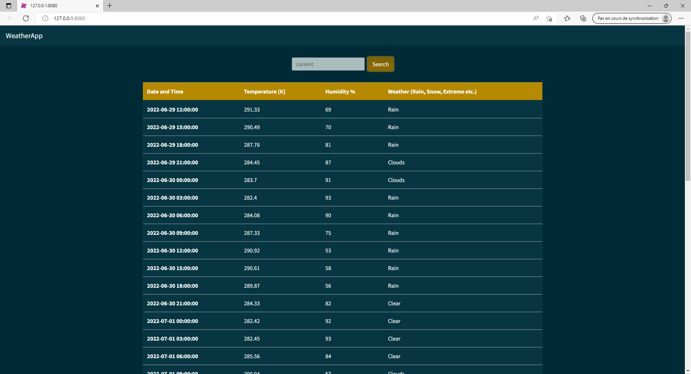

## Weather App


## Installation 

```
npm install -g aurelia-cli
```

```
au new
```

select " Default TypeScript "
select "Yes"


## Running 

```
au run --watch
```

## Components
```
au generate component Header
```
Then write "/components"

components/header.html :

```html
<template>
  <nav class="navbar navbar-expand-lg navbar-dark bg-dark">
    <a class="navbar-brand" href="#">${appTitle}</a>
    <button class="navbar-toggler" type="button" data-toggle="collapse" data-target="#navbarColor02" aria-controls="navbarColor02" aria-expanded="false" aria-label="Toggle navigation">
      <span class="navbar-toggler-icon"></span>
    </button>

    <div class="collapse navbar-collapse" id="navbarColor02">
    </div>
  </nav>
</template>
```

components/header.ts : 
```ts
export class Header {
  appTitle: string;

  constructor() {
    this.appTitle = 'WeatherApp';
  }
}
```
Create src/app.css
```css
/* src/app.css */

.container {
  margin-top: 2rem;
}
```

index.ejs : 
```html
<!DOCTYPE html>
<html>
  <head>
    <meta charset="utf-8">
    <title><%- htmlWebpackPlugin.options.metadata.title %></title>
    <meta name="viewport" content="width=device-width, initial-scale=1">
    <base href="<%- htmlWebpackPlugin.options.metadata.baseUrl %>">
    
    <!-- Add styles for Bootswatch here -->
    <link rel="stylesheet" href="https://bootswatch.com/4/solar/bootstrap.min.css">
    <!-- end Bootswatch -->
    <!-- imported CSS are concatenated and added automatically -->
  </head>
  <body aurelia-app="main">
    <script src="https://code.jquery.com/jquery-3.3.1.slim.min.js" integrity="sha384-q8i/X+965DzO0rT7abK41JStQIAqVgRVzpbzo5smXKp4YfRvH+8abtTE1Pi6jizo" crossorigin="anonymous"></script>
    <script src="https://cdnjs.cloudflare.com/ajax/libs/popper.js/1.14.3/umd/popper.min.js" integrity="sha384-ZMP7rVo3mIykV+2+9J3UJ46jBk0WLaUAdn689aCwoqbBJiSnjAK/l8WvCWPIPm49" crossorigin="anonymous"></script>
    <script src="https://stackpath.bootstrapcdn.com/bootstrap/4.4.1/js/bootstrap.min.js" integrity="sha384-wfSDF2E50Y2D1uUdj0O3uMBJnjuUD4Ih7YwaYd1iqfktj0Uod8GCExl3Og8ifwB6" crossorigin="anonymous"></script>
  </body>
</html>
```
webpack.config.js: 

```

```

src/services/weather-service.ts: 


```ts
import { HttpClient } from 'aurelia-http-client';
import { autoinject } from "aurelia-framework";
import { WeatherResponce } from 'interfaces/weather';


@autoinject
export class WeatherService {
  constructor(private httpClient: HttpClient){
    this.httpClient.configure(config => {
      config
        .withBaseUrl('https://api.openweathermap.org/data/2.5/');
    });
  }

  getForecast(city: string) {
    const appId = 'cfe13ffc0ed739646109916072a3e6bf';
    return new Promise((resolve, reject) => {
      this.httpClient.get('forecast?q=' + city + '&appid=' + appId).then(httpResponse=> {
        var forecast: WeatherResponce = JSON.parse(httpResponse.response);
        resolve(forecast.list);
      }).catch( error => {
        reject(error);
      });
    });
  }
}
```

```
npm i aurelia-http-client
```

app.ts :
```ts
import { WeatherService } from './services/weather-service'
import { inject } from 'aurelia-framework';

@inject(WeatherService)
export class App {
  city = 'New York'; // added default city
  constructor(private weatherService: WeatherService) {}

  activate() {
    this.forecast();
  }

  forecast() {
    let city = this.city //get the city from user
    this.weatherService.getForecast(city).then(forecast => {
      console.log(forecast);
    }).catch(error => {
      console.log(error);
    });
  }
}
```

app.html :
```html
<template>
  <require from="./app.css"></require>
  <require from="./components/header"></require>
  <header></header>
  <div class="d-flex justify-content-center align-items-center container">
    <div class="row">
      <div class="text-center">
        <form class="form-inline my-2 my-lg-0" submit.delegate = "forecast()" _lpchecked="1">
          <input class="form-control mr-sm-2" type="text" value.bind = "city" placeholder="Search">
          <button class="btn btn-primary my-2 my-sm-0" type="submit">Search</button>
        </form>
      </div>
    </div>
  </div>

  <!-- Add a table to display the forecast -->
  <div class="d-flex justify-content-center align-items-center container">
    <table class="table table-hover">
      <thead>
        <tr class="table-primary">
          <th scope="col">Date and Time</th>
          <th scope="col">Temperature (K)</th>
          <th scope="col">Humidity %</th>
          <th scope="col">Weather (Rain, Snow, Extreme etc.)</th>
        </tr>
      </thead>
      <tbody>
        <tr class="table-dark" repeat.for="item of forcastlist">
          <th scope="row">${item.dt_txt}</th>
          <td>${item.main.temp}</td>
          <td>${item.main.humidity}</td>
          <td>${item.weather[0].main}</td>
        </tr>
      </tbody>
    </table> 
  </div>
</template>
```

weather.ts :
```ts
export interface Main {
    temp: number;
    feels_like: number;
    temp_min: number;
    temp_max: number;
    pressure: number;
    sea_level: number;
    grnd_level: number;
    humidity: number;
    temp_kf: number;
}

export interface Weather {
    id: number;
    main: string;
    description: string;
    icon: string;
}

export interface Clouds {
    all: number;
}

export interface Wind {
    speed: number;
    deg: number;
}

export interface Sys {
    pod: string;
}

export interface Rain {
    h3: number;
}

export interface List {
    dt: number;
    main: Main;
    weather: Weather[];
    clouds: Clouds;
    wind: Wind;
    sys: Sys;
    dt_txt: string;
    rain: Rain;
}

export interface Coord {
    lat: number;
    lon: number;
}

export interface City {
    id: number;
    name: string;
    coord: Coord;
    country: string;
    population: number;
    timezone: number;
    sunrise: number;
    sunset: number;
}

export interface WeatherResponce {
    cod: string;
    message: number;
    cnt: number;
    list: List[];
    city: City;
}
```



